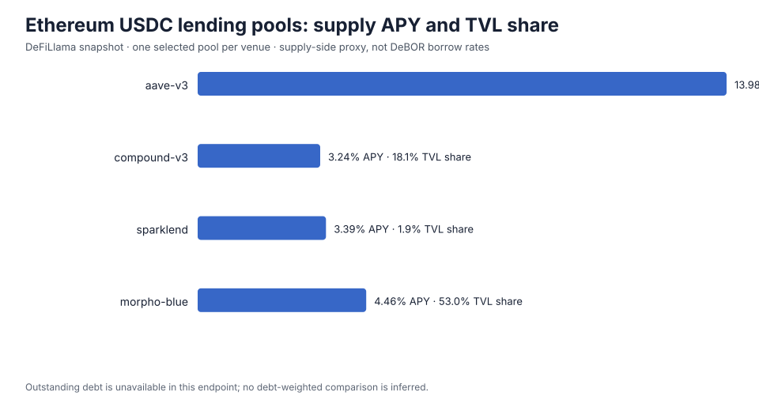

# Alternative benchmark weighting: TVL vs outstanding debt

A reproducible research scaffold for testing whether a lending-rate benchmark should weight protocol observations by TVL or by outstanding debt.

## Current status

The repository contains a captured public-data snapshot and a calculator for the requested metrics. The snapshot is **not yet a valid DeBOR borrow-rate/debt panel**: DeFiLlama's public `yields.llama.fi/pools` endpoint exposes supply-side APY and TVL, but not the corresponding outstanding debt for these exact observations. Those rows are retained as a transparent data-source audit and supply-side pilot only. The analyzer refuses to report debt-weighted results when debt is missing; it does not impute debt from TVL or utilization assumptions.

This means the empirical TVL-vs-debt conclusion remains open. A valid comparison requires same-time borrow rates, TVL, and outstanding debt for the same asset, chain, and market universe. See [methodology](docs/methodology.md) for the precise data contract and limitations.

The frozen pilot snapshot produces a TVL-weighted **supply APY** of 6.7823%, 4.3967 percentage points of cross-sectional dispersion, and HHI 0.3870 (2.58 effective sources). In this four-row sample Morpho Blue contributes 53.0% of TVL weight, Aave 27.0%, Compound 18.1%, and SparkLend 1.9%. A +100 bp rate shock at each source moves the weighted proxy by its weight in percentage points. These figures describe the selected supply pools only; they do not answer whether debt weighting is better for DeBOR.



## Reproduce the snapshot analysis

Requires Python 3.10+ and no third-party packages.

```bash
python3 scripts/analyze.py data/defillama_snapshot.csv --out results
```

The script calculates the TVL-weighted supply-rate proxy, cross-sectional rate dispersion, protocol HHI, a doubled-weight sensitivity, and a +100 bp rate-shock sensitivity. It reports the debt-weighted case as unavailable until complete `outstanding_debt_usd` values are supplied. Cross-sectional dispersion is not time-series volatility.

## Refresh source data

The capture endpoint is the public DeFiLlama Yields API:

- Current pool list: <https://yields.llama.fi/pools>
- Historical pool chart: <https://yields.llama.fi/chart/{pool_id}>
- API documentation: <https://defillama.com/docs/api>

The committed CSV is a frozen observation so results can be reproduced. The chosen observations are Ethereum USDC lending pools: one highest-TVL eligible pool per protocol; the Morpho row is one USDC-loan Morpho Blue market, not a protocol-wide aggregate. This asymmetry is intentional and documented; it is not sufficient for a DeBOR replication.

## DeBOR context

DeBOR describes its benchmark as `sum(rate_i * tvlUsd_i) / sum(tvlUsd_i)`, using on-chain borrow and supply rates and DeFiLlama TVL. Its README also describes volatility as cross-protocol rate dispersion. This project tests the weighting choice as a research question; it is not affiliated with or an implementation of DeBOR.

## Research questions

1. How much do TVL and outstanding-debt weights move the benchmark rate on the same observation set?
2. How do their concentration measures (protocol HHI / effective number of protocols) differ?
3. How much does each weighting scheme move under a fixed rate shock or a weight-inflation stress at one protocol?
4. Does a time-series volatility estimate tell a different story from cross-sectional disagreement?

No causal claim about manipulation is made from a simple shock simulation. The sensitivity measures describe mechanical exposure under stated perturbations.
