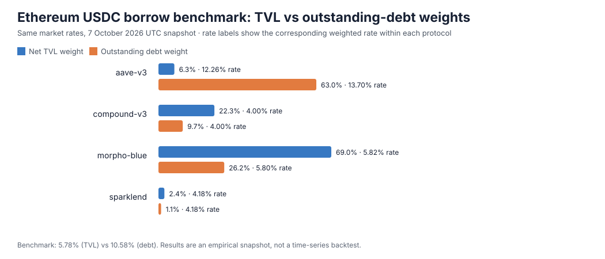

# Alternative benchmark weighting: TVL vs outstanding debt

A reproducible, snapshot-based study of how the DeBOR-style TVL-weighted USDC borrow benchmark changes when each market is weighted by its outstanding USDC debt instead.

## Finding

For a matched Ethereum USDC lending-market snapshot collected on **7 October 2026 around 00:39 UTC**, all 126 market borrow APYs were held constant and only the weights changed:

| Metric | Net-TVL weights | Outstanding-debt weights | Change |
|---|---:|---:|---:|
| Weighted borrow APY | 5.78% | 10.58% | +4.80 percentage points (+83%) |
| Weighted cross-source rate dispersion | 2.41 pp | 4.18 pp | +74% |
| Protocol HHI | 0.530 | 0.475 | lower under debt weights |
| Effective protocol count (1 / HHI) | 1.89 | 2.10 | +0.22 |

The mix changes sharply. Aave V3 rises from **6.3%** of net TVL weight to **63.0%** of outstanding-debt weight. Morpho Blue falls from **69.0%** to **26.2%**; Compound V3 falls from **22.3%** to **9.7%**; SparkLend falls from **2.4%** to **1.1%**.



The central driver is that lending TVL is net supplied capital (`totalSupplyUsd − totalBorrowUsd`), while outstanding debt is the gross amount borrowed. In this snapshot, Aave USDC reserves are highly utilized: their borrowers account for most sampled debt while the remaining net supplied TVL is comparatively small. This is evidence that the weighting choice can materially change the benchmark; it is **not** a conclusion that debt weighting is universally superior.

The result is robust to excluding Morpho markets above 15% APY: the benchmark gap remains 4.80 pp with 120 markets. It is not robust to a 10% cap: excluding all rates above 10% also removes Aave's 13.72% USDC reserve, and the two results converge to 5.32% (TVL) vs 5.26% (debt). Since DeBOR's documented cap is 500%, the main result uses the full 0–500% eligible set. This cutoff sensitivity shows the debt-weighted result is driven primarily by Aave's large, high-rate debt exposure in this snapshot.

## Data and scope

- **Asset / chain:** Ethereum USDC, same chain and loan asset across all rows.
- **Sources:** DeFiLlama public `/pools` and `/lendBorrow` endpoints joined by pool ID for Aave V3, Compound V3 and SparkLend; Morpho's public GraphQL API for all listed Ethereum markets with USDC as loan token.
- **Observation window:** API responses arrived within about seven seconds; exact receipt timestamps and excluded rows are recorded in `data/snapshot_metadata.json`.
- **Sample:** 126 borrow-positive markets: 3 Aave V3, 1 Compound V3, 1 SparkLend and 121 Morpho Blue markets. Thirteen candidates were excluded for missing data, zero balances, or a borrow APY outside 0–500% (the documented DeBOR rate bound).
- **Rates:** Base borrow APY, rewards excluded. Morpho's native APY fraction is converted to percent. Each rate is identical in both benchmark calculations.
- **TVL:** DeFiLlama lending-pool TVL, defined as total supply less total borrows. Morpho net TVL is calculated the same way from its public API.
- **Universe limitation:** This is an Ethereum-only, market-level comparison, not a reconstruction of DeBOR's configured multi-chain source list. Morpho contributes each listed eligible market, while the other protocols expose a smaller number of aggregate USDC pools. Results should be read as a focused weighting sensitivity, not a full DeBOR benchmark backtest.

The snapshot is a single point in time. “Dispersion” is the weighted standard deviation across sources at that snapshot, not historical time-series volatility. The rate-shock and weight-inflation results are mechanical sensitivities; they do not estimate the real-world cost or feasibility of manipulating an input.

## Reproduce

Requires Python 3.10+ and no third-party packages.

```bash
python3 scripts/fetch_snapshot.py
python3 scripts/analyze.py data/ethereum_usdc_borrow_snapshot.csv --out results
```

The collector writes a frozen-ready CSV plus request timestamps and exclusions. The analyzer calculates both benchmarks, weighted source dispersion, protocol-level HHI, a +100 bp per-protocol rate-shock sensitivity, a 2× per-protocol weight-inflation sensitivity, and a rate-cutoff robustness sweep. It writes JSON results and the SVG above.

## Method and references

DeBOR describes its benchmark as `sum(rate_i × tvlUsd_i) / sum(tvlUsd_i)`. This project applies the same observed rate vector to two weighting schemes:

- TVL: `sum(rate_i × netTvl_i) / sum(netTvl_i)`
- Debt: `sum(rate_i × outstandingDebt_i) / sum(outstandingDebt_i)`

Primary source references:

- [DeBOR repository and benchmark method](https://github.com/capinhoooo/debor)
- [DeFiLlama yield-server pool schema](https://github.com/DefiLlama/yield-server) — lending-pool `tvlUsd` is total supply minus total borrow.
- [Morpho API documentation](https://docs.morpho.org/developers/api/morpho/) — public market state and APY fields.
- [DeFiLlama Yields API](https://defillama.com/docs/api)

See [methodology](docs/methodology.md) and [frozen input data](data/ethereum_usdc_borrow_snapshot.csv).
